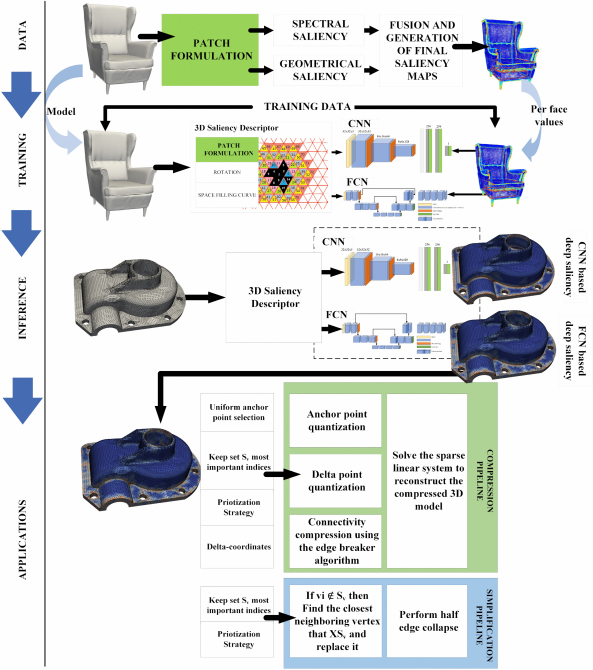
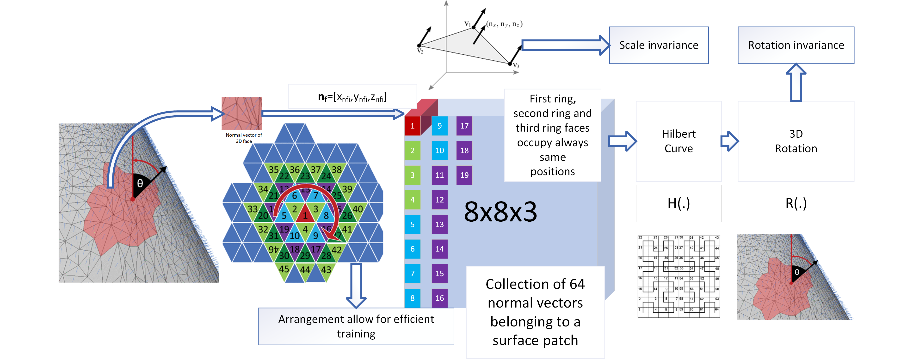
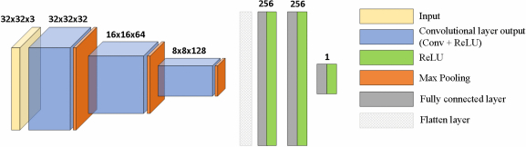
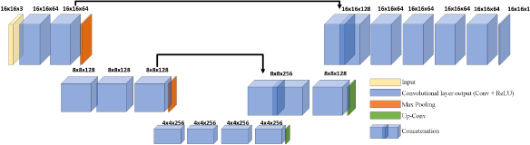

ACM Transactions on Multimedia Computing, Communications, and Applications

# Deep saliency mapping for 3D Meshes and Applications: Salient feature learning on 3D meshes and manifolds


## 1. Overview
 
 Three-dimensional (3D) meshes are widely used in various applications in different areas (e.g., industry, education, entertainment and safety). The 3D models are captured with multiple RGB-D sensors, and the sampled geometric manifolds are processed, compressed, simplified, stored, and transmitted to be reconstructed in a virtual space. These low-level processing applications require the accurate representation of the 3D models that can be achieved through saliency estimation mechanisms that identify specific areas of the 3D model representing surface patches of importance. Therefore, saliency maps guide the selection of feature locations facilitating the prioritization of 3D manifold segments and attributing to vertices more bits during compression or lower decimation probability during simplification, since compression and simplification are counterparts of the same process. In this work, we present a novel deep saliency mapping approach applied to 3D meshes, emphasizing decreasing the execution time of the saliency map estimation, especially when compared with the corresponding time by other relevant approaches. Our method utilizes baseline 3D importance maps to train convolutional neural networks. Furthermore, we present applications that utilize the extracted saliency, namely feature-aware multiscale compression and simplification frameworks.

## 2. Methodology
---
### 2.1 Overview



### 2.2 Scale-rotation invariant descriptor for salient feature learning on 3D meshes and manifolds 



</br>


### 2.3 CNN architecture for per face surface patch saliency value prediction / regression 


</br>

### 2.4 FCN for simultaneous surface patch saliency value prediction / regression 



## 3. Results
---

### 3.1 Qualitative


### 3.2 Quantitative

|                    | CNN 256 |         |      | FCN 256 |         |      |
|:------------------:|:-------:|:-------:|:----:|:-------:|:-------:|------|
|                    | Casting | Fandisk | Head | Casting | Fandisk | Head |
| Accuracy           | 0.60    | 0.73    | 0.68 | 0.59    | 0.64    | 0.67 |
| Micro precision    | 0.60    | 0.73    | 0.68 | 0.59    | 0.64    | 0.67 |
| Micro recall       | 0.60    | 0.73    | 0.68 | 0.59    | 0.64    | 0.67 |
| Micro F1 Score     | 0.60    | 0.73    | 0.68 | 0.59    | 0.64    | 0.67 |
| Macro precision    | 0.71    | 0.67    | 0.73 | 0.70    | 0.53    | 0.70 |
| Macro recall       | 0.49    | 0.56    | 0.38 | 0.49    | 0.43    | 0.36 |
| Macro F1 Score     | 0.45    | 0.59    | 0.41 | 0.44    | 0.44    | 0.38 |
| Weighted precision | 0.66    | 0.71    | 0.67 | 0.66    | 0.61    | 0.66 |
| Weighted recall    | 0.60    | 0.73    | 0.68 | 0.59    | 0.64    | 0.67 |
| Weighted F1 Score  | 0.53    | 0.70    | 0.62 | 0.52    | 0.60    | 0.60 |


### 3.3 Performance


| **Model**                 | **Faces**   |      | **I/O** | **RPCA** | **CNN** |     |     |         |     |     | **FCN** |     |         |     |
|---------------------------|-------------|------|---------|----------|---------|-----|-----|---------|-----|-----|---------|-----|---------|-----|
| **Platform**              |             |      | **CPU** | **CPU**  | **CPU** |     |     | **GPU** |     |     | **CPU** |     | **GPU** |     |
| Patch size                |             |      |         | 60       | 16      | 64  | 256 | 16      | 64  | 256 | 64      | 256 | 64      | 256 |
| Execution times (seconds) | Head        | 88K  | 18      | 635      | 27      | 57  | 171 | 30      | 59  | 180 | 43      | 160 | 16      | 46  |
|                           | Centurion   | 200K | 41      | 1863     | 61      | 128 | 399 | 71      | 140 | 397 | 98      | 352 | 35      | 115 |
|                           | Stonecorner | 300K | 63      | 5775     | 100     | 198 | 637 | 117     | 217 | 608 | 153     | 547 | 59      | 166 |

## 4. Implementation
---

### 4.1 Requirements
```
pickle
glob
tensorflow
keras
```
### 4.2 Groundtruth generation
```
python saliencyGenerateRPCAGroundTruth.py
```


### 4.3 Training of CNN
```
python saliencyTrainSaliency01CNN.py
```

### 4.3 Training of FCN
```
python saliencyTrainSaliency02FCN.py
```


### 4.5 Inference
```
python saliencyPredictSaliency01CNN.py

```


```
python saliencyPredictSaliency02FCN.py

```
## 5. Citation

```
Stavros Nousias, Gerasimos Arvanitis, Aris Lalos, and Konstantinos Moustakas. 2023. Deep Saliency Mapping for 3D Meshes and Applications. ACM Trans. Multimedia Comput. Commun. Appl. 19, 2, Article 71 (March 2023), 22 pages. https://doi.org/10.1145/3550073
```